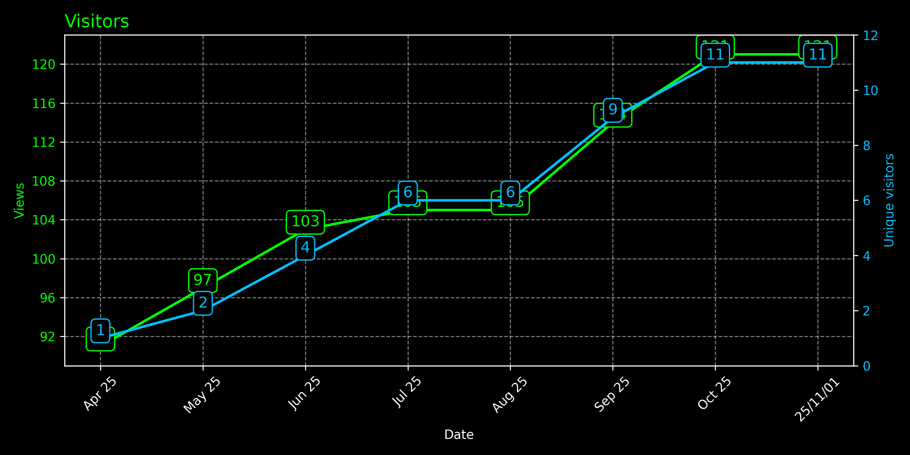
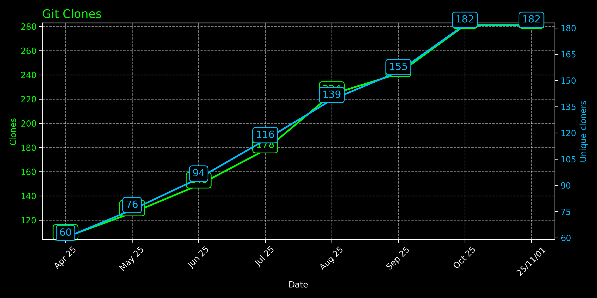

# GitHub Traffic Insights
A GitHub-Actions-based tool that allows you to easily analyze and visualize GitHub repository activity over 14 days. It processes data related to visits, clones, referring sites, and popular content, generating insightful graphs and reports to track repository performance.

---
## How to Use it

### 1. Fork or Clone this repository
> This is a public repository, so you can fork it to your own GitHub account.
> You can also clone it and create a private repository if you want to keep your data private.

The repository will contain the workflow that will be used to collect the data and generate the report.
The report will be generated in the README file and show you analytics of all the repositories you choose to analyze.

### 2. Add your GitHub Token in the repository secrets
The token is used to authenticate the GitHub API requests.
> You can create a new token by going to your GitHub account settings, then "Developer settings", then "Personal access tokens". Make sure to give it the `repo` scope.

- Go to your repository settings.
- Click on "Secrets and variables" in the left sidebar.
- Click on "Actions" under "Secrets and variables".
- Click on "New repository secret".
- Add a new secret with the name `GH_SECRET_TOKEN` and paste your GitHub token as the value.

### 3. Set up the configuration
You can configure the `theme` and `repositories` that you want to track by editing the `config.json` file. 
All themes are available in `themes.json` file, you can choose any of the themes listed there.

```json
{
  "script_to_run": "src/main.py",
  "data_dir": "./data",
  "images_dir": "./images",
  "theme": "chartreuse-dark",     # Add your favorite theme here
  "owner": "mriusero",            # Set up your GitHub username here
  "repositories": [
  "GitHub-Traffic-Insights"                 # List the repositories you want to track here
  ]
}
```

### 4. Configure the workflow (optional)
The workflow is set to run once a day. 
> You can change the schedule by editing the `cron` expression in the `.github/workflows/update_traffic_stats.yml` file.  

> You can also trigger the workflow manually by going to the "Actions" tab in your repository and clicking the "Run workflow" button.

---
## Report
The report will be generated in the `README.md` file. It will show you the following information for each repository you choose to track:
- **Repository citation card:** shows the repository with the number of stars, forks, and issues.
- **Visitors graph:** shows the number of visitors and unique visitors.
- **Clones graph:** shows the number of clones and unique clones.
- **Referring sites:** shows referring sites that led to visits to the repository.
- **Popular content:** shows the most popular content in the repository.

> For graphs, to display information over 14 days, past years data are annually, past months data are monthly, and current month data are daily. This allows to see the global trends over time.

See below an example of the report generated by the tool for this repository.

---
# My Repositories Analytics 👾


---
## GitHub-Traffic-Insights


[See repo](https://github.com/mriusero/GitHub-Traffic-Insights)





---
## RepoMetricsVisualizer


[See repo](https://github.com/mriusero/RepoMetricsVisualizer)


